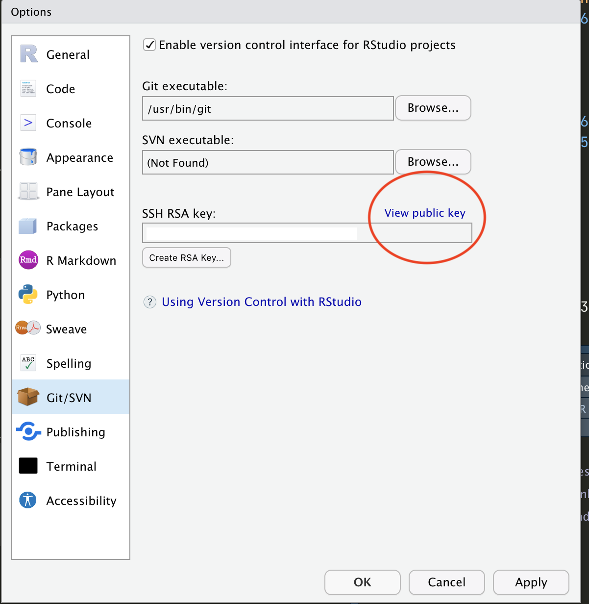
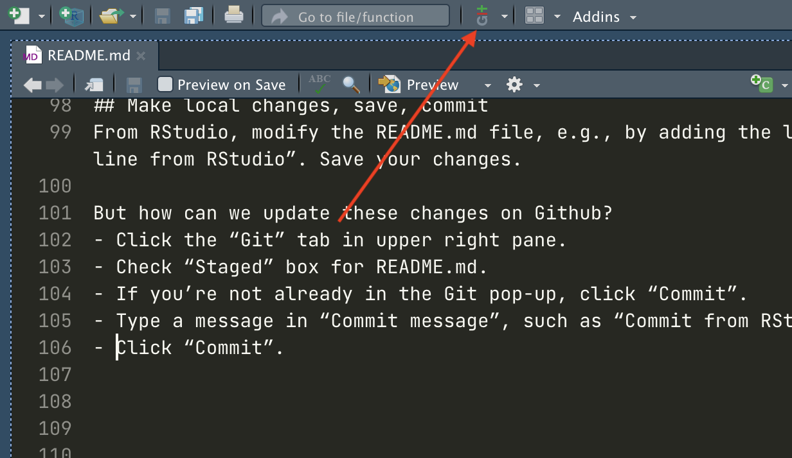

# Getting-Started-with-Github-and-R

A brief tutorial on using Github with R and Rstudio.
Note: the tutorial closely follows [Happy Git with R](https://happygitwithr.com/index.html).
The instructions below assume the following:

1.  You have [R](https://cloud.r-project.org/) and [RStudio](https://www.rstudio.com/products/rstudio/) installed

2.  You have created a [Github account](https://github.com/join)

After ensuring the above, it is important to check whether you have Git installed.
See below.

## What is Github?

Github is a hosting service for Git.
A hosting service provides an online repository for your Git-based projects on the internet.
It allows other people to see your stuff, sync up with you, and perhaps even make changes.
It's a lot like Dropbox but much, much better.

## What is Git?

Git is a [version control system](https://en.wikipedia.org/wiki/Version_control).
Its original purpose was to help groups of developers work collaboratively on big software projects.
Git manages the evolution of a set of files -- called a repository -- in a logical, highly structured way.
As explained by the very helpful [Happy Git with R](https://happygitwithr.com/big-picture.html), a version control system (i.e., Git) can be thought of as analogous to the "Track Changes" features from Microsoft Word.
More importantly, it also helps you maintain stable versions of your model or data analysis, since the R version and packages used are kept 'as is' when you initiate the project.

# Install Git

You can check if you have Git already installed by writing the following in your shell:

```{git}
which git
git --version
```

This shows where your git files may be located.

## Windows

Install Git for [Windows](https://gitforwindows.org/).

## macOS

If you have already installed XCode during your R installation (which is required) first check that you have Git (you probably do):

```{git}
git --version
git config
```

Accept the offer!
Click on "Install".

Note: after upgrading macOS, you might need to re-do the above and/or re-agree to the Xcode license agreement.

## Configure Git

In your terminal, write the following, one at a time:

```{git}
git config --global user.name 'Jane Doe'
git config --global user.email 'jane@example.com'
git config --global --list
```

**Note: substitute your name and the email associated with your GitHub account!**

## Create Security Protocol

Here we have to set up [SSH keys](https://en.wikipedia.org/wiki/Ssh-keygen).
We advise the following instructions for beginners.
If you are more advanced and want to follow the recommended Github security protocols, follow these instructions: <https://happygitwithr.com/ssh-keys.html#option-2-set-up-from-the-shell>

To check, open RStudio and go to `Tools > Global Options > Git/SVN`.
If you see something like `~/.ssh/id_rsa` in the SSH RSA Key box, you definitely have existing keys.If nothing shoes up, go to your terminal and type the following:

```{git}
ls -al ~/.ssh/
```

If you are told `~/.ssh/` doesn't exist, you don't have SSH keys!

### Create an SSH key pair

In Rstudio, go to: `Tools > Global Options…> Git/SVN > Create RSA Key`

RStudio then prompts you for a pass-phrase.
It is optional, but also a best practice.
Configuring your system for smooth operation with a pass-phrase-protected key introduces more moving parts.
If you're completely new at all this, skip the pass-phrase and implement it next time, when you are more comfortable with system configuration.
I did not use a pass-phrase at first, but I do now, and record it in a password manager.

Click `Create` and RStudio will generate an SSH key pair, stored in the files `~/.ssh/id_rsa and ~/.ssh/id_rsa.pub`.

Now, stay at `Tools > Global Options > Git/SVN > Create RSA Key` and select the 'Public Keys' option on the menu (shown below) and copy the Public SSH key.



Note: **do not use HTTPS** as Github no longer supports HTTPS authentication.

# Connect Git and GitHub

This section will ensure that your computer is able to 'talk' to Github, using Git.
If it doesn't, you have likely made an error during installation and configuration.

## Connect Public SSH Key to Github

In your Github account, go to settings and in the "Access" section of the sidebar, click SSH and GPG keys.

Click **New SSH key** or **Add SSH key**


In the `Title` field, add a descriptive label for the new key.
For example, if you're using a personal Mac, you might call this key `Personal MacBook Key`.

Then paste your key into the `Key` field and click **Add SSH** key.


**Note:** if prompted, confirm your GitHub password.

## Make a repo on GitHub

Go to <https://github.com> and make sure you are logged in.
Near `Repositories`, click the big green `New` button.
Or, if you are on your own Github profile page, click on `Repositories`, then click the big green `New` button.

*What options to select and how to fill this in:*

-   Repository template: No template.

-   Repository name: 'myrepo' or whatever you wish (we'll delete this soon).

-   Description: `Repository for testing my Git/GitHub setup` or similar.
    It's nice to have something here, so you'll see it appear in the README.
    We use this space to provide a general overview of the repository and the associated project(s).
    You can go into great detail, for example see [this](https://github.com/18F/open-source-guide/blob/18f-pages/pages/making-readmes-readable.md).

-   Choose `Public` if you want the repository to be open-source and accessible to anyone, or `Private` if you want to control who sees the repository.

-   Initialize this repository with: Add a README file.

-   Click the big green button that says `Create repository`.

-   Now click the big green button that says `<> Code`.

-   Copy a clone URL to your clipboard.

**Note: since we're using an SSH protocol, make sure to copy the SSH URL**.

## Clone the test GitHub repository to your computer via RStudio

In RStudio, start a new Project:

-   `File > New Project > Version Control > Git`

-   In `Repository URL`, paste the URL of your new GitHub repository you have just created.
    **Remember to copy the correct SSH URL**!

-   It will be something like this:

```{git}
https://github.com/janedoe/myrepo.git.
```

-   Don't see an option to get the Project from Version Control?
    Restart RStudio and try again.

-   Still no luck?
    See [chapter 13](https://happygitwithr.com/rstudio-see-git.html) of Happy Git with R for trouble shooting Git and RStudio

-   Accept the default project directory name, e.g. `myrepo`, which coincides with the GitHub repo name.

-   **Take charge of, or at least notice, where the Project will be saved locally. A common mistake is to have no idea where you are saving files or what your working directory is.**

-   Check `Open in new session`

-   Click `Create Project`

Now, if everything has been done correclty, you should find yourself in a new local RStudio Project that represents your test repo on GitHub.
This should download the README.md file from GitHub.
Look in RStudio's file browser pane for the README.md file.

## Make local changes, save, commit

From RStudio, modify the README.md file, e.g., by adding the line "This is a line from RStudio".
Save your changes.

But how can we update these changes on Github?

-   Click the `Git` tab in upper right pane.

-   Check `Staged` box for the `README.md` file. You are selecting which changes to which files will be uploaded.

-   If you're not already in the Git pop-up, click `Commit`.

-   Type a message in `Commit message`, such as `Commit from RStudio`. Note that you have to do this. Although you can type whatever message you want, it is helpful to be descriptive and especially good practice when you are collaborating with others on the same repository. For example, if you just changed some spelling errors on a file, type `edited misc spelling in file.R`.

-   Finally, click `Commit`.

**See the image below to help you find these buttons!**



## Push your local changes online to GitHub

Click the green `Push` button to send your local changes to GitHub. And, again, if everything has been set up correctly, you should see the new new changes in your repository! If something isn't working, you have most likely gone wrong in one or more of the above steps. However, make sure to read through the trouble-shooting section of [Happy Git for R](https://happygitwithr.com/rstudio-see-git.html).